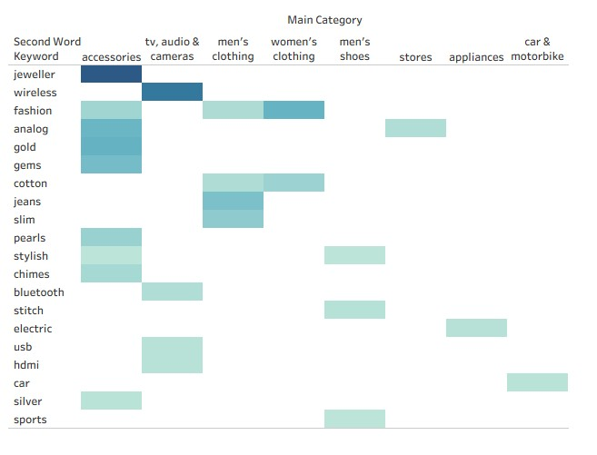

# E-commerce Taxonomy Optimization & Search Relevance Data Analysis

## 📌 개요 (Overview)
이커머스 플랫폼의 핵심인 상품 분류 체계(Taxonomy)와 고객의 검색 의도(Search Intent) 간의 정합성을 진단하기 위한 데이터 분석 프로젝트입니다. 단순한 데이터 추출을 넘어, 상품 메타데이터와 카테고리 매핑 간의 오류를 발견하고 검색 품질(Search Relevance)을 높이기 위한 데이터 정제 및 최적화 로드맵을 구축했습니다.

---

## 🛠 Tech Stack
* **Language & Database:** SQL (SQLite), Python (Pandas, Scikit-learn)
* **Visualization:** Tableau Public
* **Methodology:** 
    * **Data Cleaning:** Heuristic Filtering, Stop-words Management, Regex Pattern Matching
    * **Analysis:** Exploratory Data Analysis (EDA), Text Mining (Keyword Extraction)
    * **Automation:** TF-IDF (Term Frequency-Inverse Document Frequency)

---

## 📊 프로젝트 프로세스 (Project Workflow)

### 1. SQL 기반 데이터 정제 (SQL Data Wrangling)
상품명 데이터의 노이즈를 제거하고 유의미한 키워드만 추출하는 파이프라인을 구축했습니다.
* **로직:** '두 번째 단어 추출 전략'을 통해 브랜드 편향(Brand Bias)을 제거하고 상품의 본질적인 속성(e.g., Wireless, Jeans)을 식별했습니다.
* **정제:** 길이, 숫자/소수점 패턴 매칭, 도메인 특화 불용어(Stop-words) 리스트를 활용해 데이터 정밀도를 높였습니다.

### 2. 시각화 및 문제 진단 (Tableau Heatmap)
정제된 데이터를 바탕으로 카테고리와 핵심 키워드 간의 연관성을 히트맵으로 시각화했습니다.
* **매핑 모호성 탐지:** 여러 카테고리에 중복 분포하는 키워드 식별.
* **덤프 카테고리(Dump Category) 식별:** 속성이 모호한 카테고리 구조 발견.

### 3. 기술적 확장 로드맵 (Python & TF-IDF)
수동 정제 방식의 한계를 극복하기 위해 통계적 기법인 **TF-IDF** 모델을 도입했습니다. 특정 카테고리에서만 변별력이 높은 키워드를 자동으로 추출하여, 운영 효율성을 극대화하는 로드맵을 설계했습니다.

---

## 🔍 핵심 통찰 (Key Insights)
1. **데이터 정합성:** 정제된 키워드와 카테고리의 매핑 패턴을 통해 Taxonomy의 안정성을 검증함.
2. **비즈니스 정렬:** 정제 기준을 '기술적 정확성'뿐만 아니라 '고객의 검색 행동'이라는 비즈니스 관점에서 정의함.
3. **지속 가능한 구조:** Taxonomy는 고정된 체계가 아니라, 검색 트렌드에 맞춰 반복적으로 최적화되어야 하는 '살아있는 구조'임을 이해함.

---

# E-commerce Taxonomy Optimization & Search Relevance Data Analysis

## 📌 Overview
This project evaluates the alignment between **product taxonomy structures and actual customer search intent**. By analyzing large-scale product metadata, I diagnosed inconsistencies, structural anomalies, and mapping ambiguities, providing a data-driven roadmap to enhance search relevance.

---

## 🛠 Tech Stack
* **Language & Database:** SQL (SQLite), Python (Pandas, Scikit-learn)
* **Visualization:** Tableau Public
* **Methodology:** 
    * **Data Cleaning:** Heuristic Filtering, Stop-words Management, Regex Pattern Matching
    * **Analysis:** Exploratory Data Analysis (EDA), Text Mining (Keyword Extraction)
    * **Automation:** TF-IDF (Term Frequency-Inverse Document Frequency)

## 📊 Project Workflow

### 1. Data Cleaning (SQL Data Wrangling)
Constructed a multi-step refinement pipeline to extract meaningful product attributes from raw product titles.
* **Keyword Strategy:** Implemented a 'Second-Word Extraction' logic to mitigate brand bias and focus on inherent product attributes (e.g., Wireless, Jeans).
* **Refinement:** Applied heuristic rules (length constraints, numerical pattern matching) and stop-word management to isolate high-value data.

### 2. Visualization & Diagnosis (Tableau Heatmap)
Utilized Tableau heatmaps to visualize the mapping relationship between product categories and extracted keywords.
* **Ambiguity Detection:** Identified scattered keywords that degrade search ranking.
* **Dump Category Diagnosis:** Pinpointed categories with weak structural definitions that need restructuring.

### 3. Technical Roadmap (Python & TF-IDF)
Proposed an automated pipeline using **TF-IDF** to handle large-scale datasets, mathematically weighing keyword discriminative power to reduce reliance on manual cleaning.

---

## 🔍 Key Insights
1. **Data Alignment:** Validated taxonomy reliability by identifying consistent mapping patterns across primary product categories.
2. **Business-Oriented Cleaning:** Defined data refinement criteria based on search behavior and category-specific discriminative power.
3. **Scalability:** Demonstrated the ability to transition from heuristic-based manual cleaning to automated statistical models (TF-IDF) for enterprise-level data processing.

---

> **"This project demonstrates my ability to define business problems through data, engineer robust refinement pipelines, and provide strategic optimization insights."**
